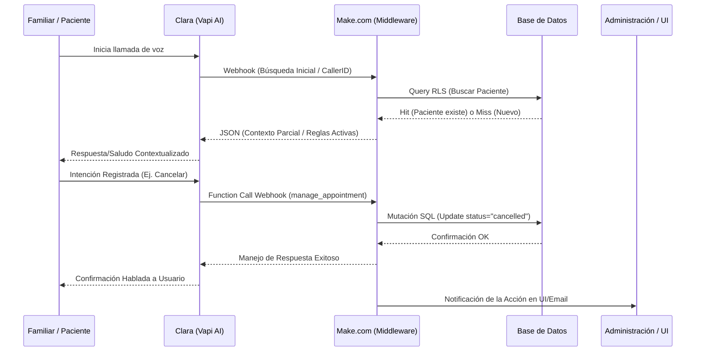

# Documento Técnico de Casos de Uso: Centro Proyecta & Asistente IA (Clara)

Este documento define la arquitectura de interacciones, los actores del sistema y los flujos de casos de uso principales para la gestión del Centro Proyecta, integrando al personal clínico/administrativo y a la asistente de Inteligencia Artificial (Clara).

---

## 1. Actores del Sistema

### 1.1 Actores Humanos
* **Administración (Admin):** Personal encargado de la gestión global de la clínica, la supervisión del estado del calendario general, la facturación global, altas/bajas de terapeutas y resolución de triajes escalados por Clara.
* **Terapeuta:** Especialista clínico que provee servicios de atención a los pacientes asignados. Gestiona su calendario individual, el registro clínico, su asistencia diaria y el fichaje de jornada laboral.
* **Familiar / Paciente:** Persona que contacta con la clínica para solicitar información, agendar nuevas citas, o gestionar cambios/cancelaciones sobre las citas de los pacientes en el sistema.

### 1.2 Actores Sistémicos
* **Clara (Vapi):** Asistente de voz de Inteligencia Artificial. Se comunica en lenguaje natural por teléfono con los familiares, entiende la intención de la llamada, recoge datos y dispara acciones estructuradas (webhooks).
* **Make (Orquestador):** Plataforma de automatización de flujos que actúa como *"Middleware"*. Recibe los webhooks estructurados por Clara, ejecuta la lógica de negocio (búsquedas, filtros, condicionales) y se comunica con la base de datos de manera bidireccional.
* **Supabase (Base de Datos):** Base de datos relacional (PostgreSQL) y backend en la nube que actúa como la fuente única de verdad. Almacena las tablas de `patients`, `appointments`, `therapists`, `billing`, y expone APIs seguras mediante Row Level Security (RLS).

---

## 2. Casos de Uso: Centro Proyecta (Terapeutas y Administración)

### CU-C01: Gestión General de Citas y Calendario
* **Actor:** Administración, Terapeutas.
* **Descripción:** Visualización de un calendario global o filtrado por terapeuta, con códigos de colores semánticos (Programada, Cobrada/Asistida, Cancelada).
* **Flujo:** Creación manual, lectura, edición (cambio horario/estado) y eliminación de citas. Los cambios se sincronizan en tiempo real con Supabase y modifican el estatus visual.

### CU-C02: Gestión de Asistencia y Facturación
* **Actor:** Administración.
* **Descripción:** Generación automática y visual de transacciones en la vista de Facturación al modificar el estatus de una cita a "Asistida" o registrar su cobro.
* **Flujo:** Las tarjetas interactivas de Resumen Financiero se alimentan de los registros en tabla `billing`. Las cancelaciones o eliminaciones sincronizan directamente (eliminan/ajustan) el registro financiero asociado en Supabase.

### CU-C03: Gestión de Terapeutas y Pacientes
* **Actor:** Administración.
* **Descripción:** Control CRUD (Create, Read, Update, Delete) centralizado del personal clínico y de la cartera de pacientes activos/inactivos o en lista de espera.
* **Flujo:** Los pacientes nuevos (prospectos) entran por defecto en lista de espera para ser reasignados.

---

## 3. Casos de Uso: Clara (Vapi Asistente IA)

### CU-IA01: Reconocimiento de Familiares
* **Responsable:** Clara (Vapi) + Make + Supabase.
* **Descripción:** Al iniciar una llamada o recibir datos iniciales, Clara debe clasificar si es un Familiar Registrado (asociado a un paciente) o un Contacto Nuevo.
* **Flujo Técnico:**
  1. **Vapi:** Recopila información básica y/o teléfono de origen. Dispara webhook de validación hacia Make.
  2. **Make:** Busca en Supabase (`patients` table) usando el teléfono.
  3. **Make -> Vapi:** Devuelve JSON: `{"status": "existing", "patient": {...}}` o `{"status": "new"}`.
  4. **Vapi (Clara):** Si existe, adapta su prompt: *"Hola Ana, ¿llamas en relación a las sesiones de Pablo?"*. Si es nuevo, inicia el protocolo de nueva admisión.

### CU-IA02: Triaje de Consultas Administrativas
* **Responsable:** Clara (Vapi).
* **Descripción:** Clara determina la urgencia e intención de una llamada de un prospecto o familiar para derivar, resolver o registrar.
* **Flujo Técnico:**
  1. **Vapi (Clara):** Escucha y analiza (LLM) el motivo de la consulta.
  2. **Clasificación:** Etiqueta la intención (e.g., *Evaluación*, *Urgente/Prioritario*, *Información General*).
  3. **Vapi -> Make -> Supabase:** Si es prospecto prioritario (Triaje Alto), se dispara un webhook `trigger_alert`.
  4. **Make:** Registra en la BD (`waiting_list`) con la categoría prioritaria y notifica inmediatamente al Director del Centro por email/notificación, finalizando la llamada adecuadamente.

### CU-IA03: Gestión de Citas (Reservas y Cancelaciones)
* **Responsable:** Clara (Vapi) + Make + Supabase.
* **Descripción:** Modificaciones en el calendario bajo estrictas reglas de negocio operadas por IA.
* **Flujo Técnico - Cancelaciones:**
  1. **Restricción (Vapi):** Solo permite modificar si el flujo validó a un paciente existente (`status == "existing"`).
  2. **Vapi:** Toma intención "cancelar cita" y dispara la función `manage_appointment` vía webhook.
  3. **Make:** Localiza cita futura en Supabase, cambia status a `cancelled`. Libera horario y notifica a la UI.
* **Flujo Técnico - Reservas (Nuevas):** Si un Prospecto pide cita, Clara recopila variables clínicas para triaje. No reserva en calendario clínico; inserta datos en `waiting_list`. Cederá el contacto a Administración.

### CU-IA04: Seguimiento de Asistencia
* **Responsable:** Cron (Make) -> Vapi (Clara) -> Supabase.
* **Descripción:** Seguimiento telefónico proactivo hacia familias cuando un paciente se ausenta o la cita queda abierta/sin re-agendar.
* **Flujo Técnico:**
  1. **Make (Scheduled Trigger):** Busca en Supabase (ej: Citas de ayer marcadas como "No Asistió").
  2. **Make -> Vapi (Outbound):** Lanza instrucción a Vapi para que llame saliente al familiar asociado.
  3. **Vapi (Clara):** Interactúa, pregunta motivo de ausencia con tono empático y ofrece alternativas.
  4. **Vapi -> Make -> Supabase:** Recoge el motivo de ausencia (notas) o si solicitan una nueva fecha, actualizando el seguimiento en la base de datos.

---

## 4. Arquitectura de Integración (Flujo de Información)

La integración sigue este patrón en forma de ciclo cerrado de asincronía y llamadas a funciones estructuradas (Schemas):

### Componentes Críticos del Puente "Vapi - Make - Supabase"
1. **Server URLs / Webhooks:** Las operaciones en Vapi (Server URL config) apuntan a URLs generadas por módulos `Custom Webhook` en Make.com.
2. **Estructura JSON (Body Scheme):** Clara interactúa enviando objetos JSON fuertemente tipados a través del Payload, nunca texto crudo a parsear por Make.
3. **Respuesta Transparente:** Vapi está diseñado para congelar la conversación milisegundos hasta que Make responda con un JSON limpio. La información se inyecta en el contexto de Clara para formular la próxima frase verbal.
